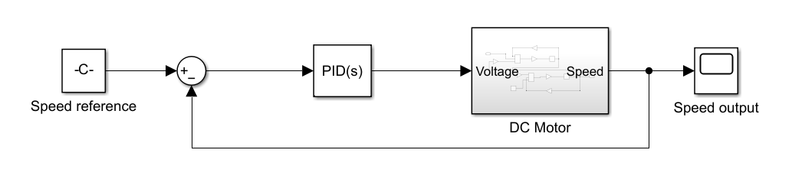
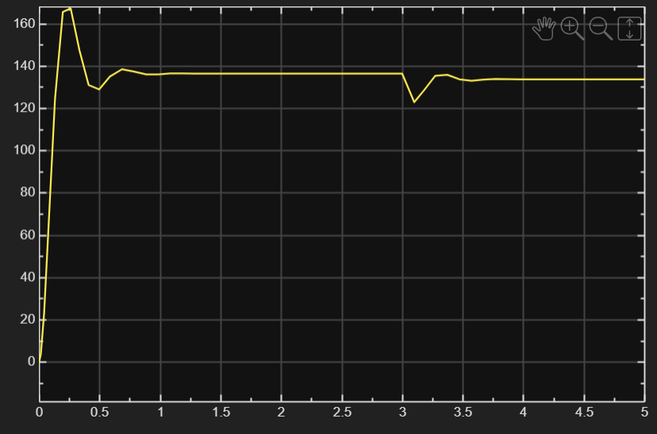
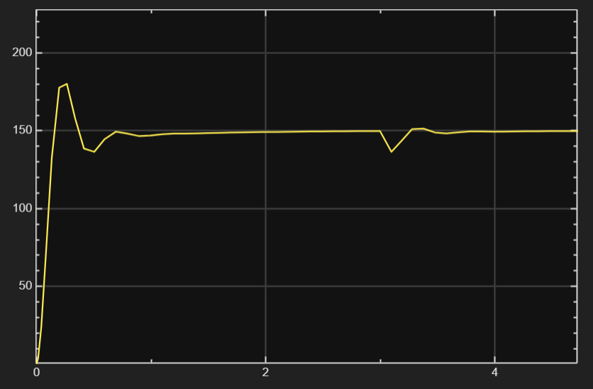
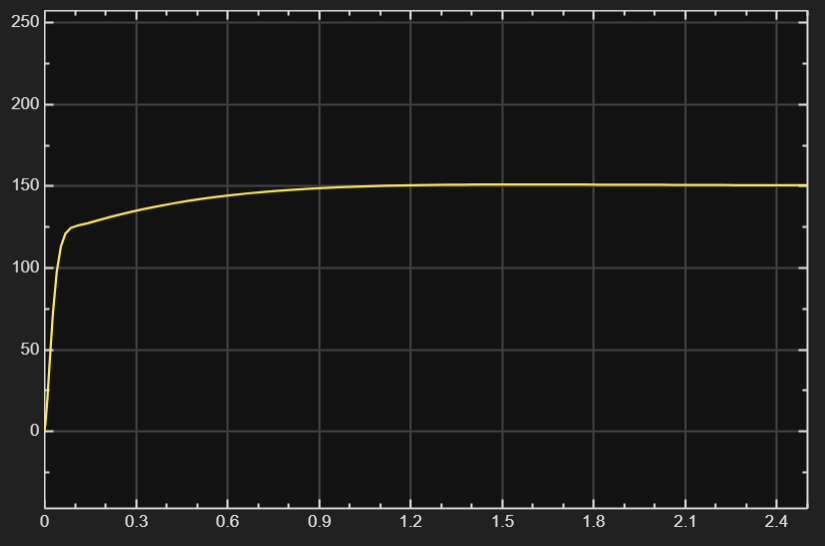
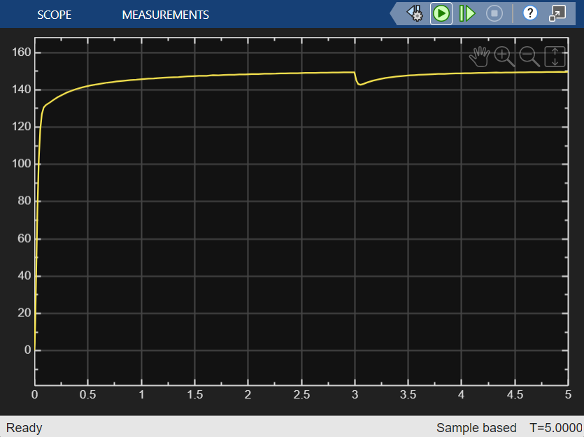

# DC Motor Modeling and PID Speed Control using MATLAB & Simulink

**Overview**

This project develops a mathematical model of a brushed DC motor and designs closed-loop feedback controllers to regulate motor speed under varying operating conditions. 

**Project Goals**
- Derive a DC motor model from physical principles
- Implement transfer-function and state-space models in MATLAB
- Analyze open-loop motor behavior
- Design and tune P, PI, PID controllers
- Build a Simulink model of the complete closed-loop system
- Investigate disturbance rejection under different load torques

**System Modeling**

*Mechanical equation*
$$T - b\dot{\theta} = J\ddot{\theta}$$

*Electrical equation*
$$L\frac{di}{dt} + Ri = V - V_{emf}$$

Assuming that motor torque is proportional to the armature current by constant K_t 

$$T = K_ti$$

The back emf, V_{emf}, is proportional to the angular velocity by constant K_e

$$V_{emf} = K_e\dot{\theta}$$

In SI units, $$K_t = K_e$$, represented as K. 

This yields two equations.

$$Ki - b\dot{\theta} = J\ddot{\theta}$$

$$V - Ri - L\frac{di}{dt} - k\dot{\theta} = 0$$

**Transfer Function**

By applying the Laplace transform, we express these equations in terms of the Laplace variable s. 

$$KI(s) - bs\theta(s) = Js^2\theta(s)$$

$$V(s) - RI(s) - LsI(s) - Ks\theta(s) = 0$$

We can rewrite these into one transfer function by using the common $$I(s)$$ variable, and it is expressed as the rotational output over the voltage input. 

$$ I(s) = \frac{s\theta(s)(Js+b)}{K} $$

$$ (Ls+R)I(s) = V(s)-Ks\theta(s) $$

$$\frac{\dot{\theta}(s)}{V(s)} = \frac{K}{(Js+b)(Ls+R) + K^2} $$

**State-space model**

We choose our state variables to be the rotational speed and electric current, $$\dot{\theta}$$ and $$i$$.

$$\ddot{\theta} = \frac{K}{J}i - \frac{b}{J}\dot{\theta}$$

$$\frac{di}{dt} = \frac{V}{L} - \frac{R}{L}i - \frac{K}{L}\dot{\theta}$$

```math
\frac{d}{dt}
\begin{bmatrix}
\dot{\theta} \\
i
\end{bmatrix}
=
\begin{bmatrix}
\frac{-b}{J} & \frac{K}{J} \\
\frac{-K}{L} & \frac{-R}{L}
\end{bmatrix}
\begin{bmatrix}
\dot{\theta} \\
i
\end{bmatrix} +
\begin{bmatrix}
0 \\
\frac{1}{L}
\end{bmatrix} V
```

$$ 
y = [1
0]
\begin{bmatrix}
\dot{\theta} \\
i
\end{bmatrix}$$

**Controller Design**

The closed-loop speed control is designed using proportional (P), proportional-integral (PI), and proportional-integral-derivative (PID) controllers. 

**Simulink Model**

<p align="center">
  
</p>

**Results**

P Controller shows improved steady-state speed but shows overshoot error and steady-state error. 

<p align="center">
  
</p>

PI Controller reduces steady-state error but overshoot remains.

<p align="center">
  
</p>

PID Controller results in the fastest settling time and eliminates both overshoot and steady-state errors. 

<p align="center">
  
</p>

Disturbance Rejection

A step load torque disturbance was applied during operation, and the PID controller shows the fastest recovery and the least speed deviation.

<p align="center">
  
</p>
